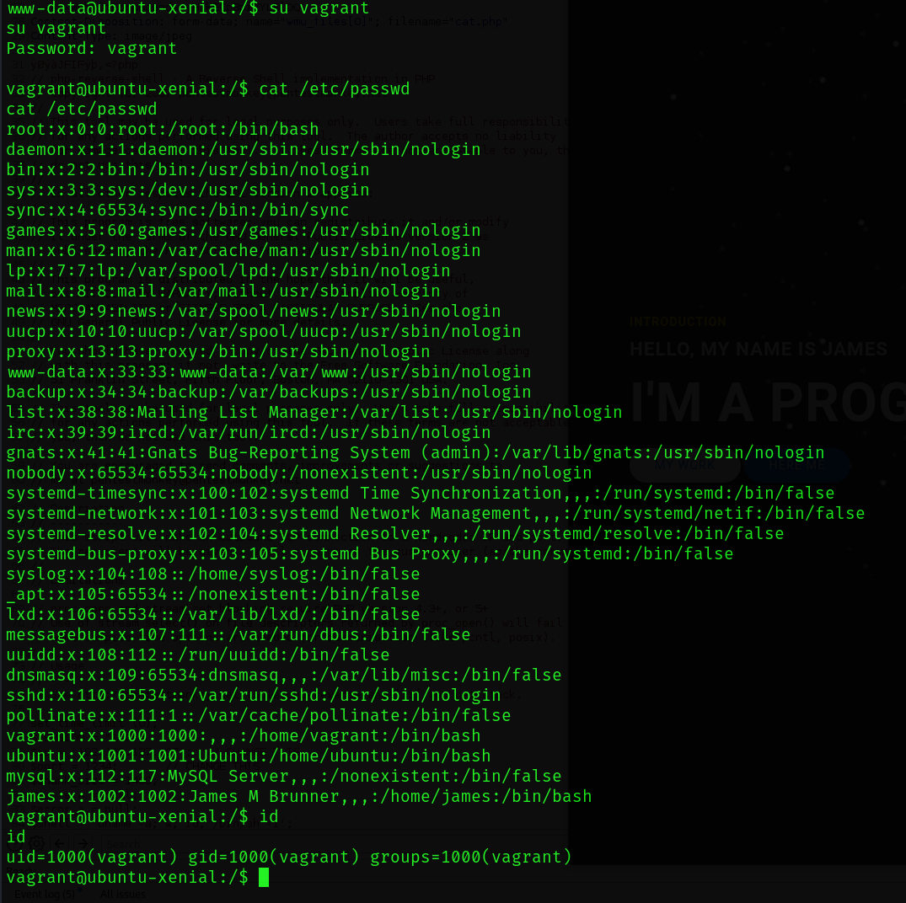

# Write-up Blogger

## 1. Enumeration

i used ```netdiscover```  to see real IP mylab

``` terminal
netdiscover
```


ip : ```192.168.137.195```

i used nmap to see port open 

```terminal
sudo nmap -sC -sV -vvv -p- --min-rate=1000 192.168.137.195
```

*   sC : Enable default script to quick and safe
*   sV : Detect service
*   vvv : increase verbosity
*   p : port to scan "-p-" is all port 1-65535
*   min-rate=1000 : packets are sent < 1000s


22 is ``` ssh ```
80 is ``` http ```

after recon all site redirect domain ```blogger.thm``` so we will change to ip is domain :3 on ```/etc/hosts```

```
nano /etc/hosts
```


this site show all dir on this site  ``` http://blogger.thm/assets/fonts/blog/ ``` is ```wordpress```

i used ```wpscan```  and i see a plugin outdate is ```wpsdiscuz``` after that i decide find vuln on this.

```
wpscan --url http:/blogger.htm/assets/fonts/blog/?id=1 
```


```
searchsploit wpdiscuz
```


## 2. Post Exploitation
we can ```RCE``` by upload let's try . This uploads check ```mine-type``` so we need upload but we dont change content of this file 


## 3. Privilage Escalation

i will spawn tty shell with python

```
python3 -c 'import pty; pty.spawn("/bin/bash")'
export TERM=xterm
```

after that i try ssh with vagrant with his user is password .



i used ```sudo -l ``` and this user can go```root``` with vargrant user

```
sudo su
```


## Stuck many time :<  i'm so stupid guy :< 