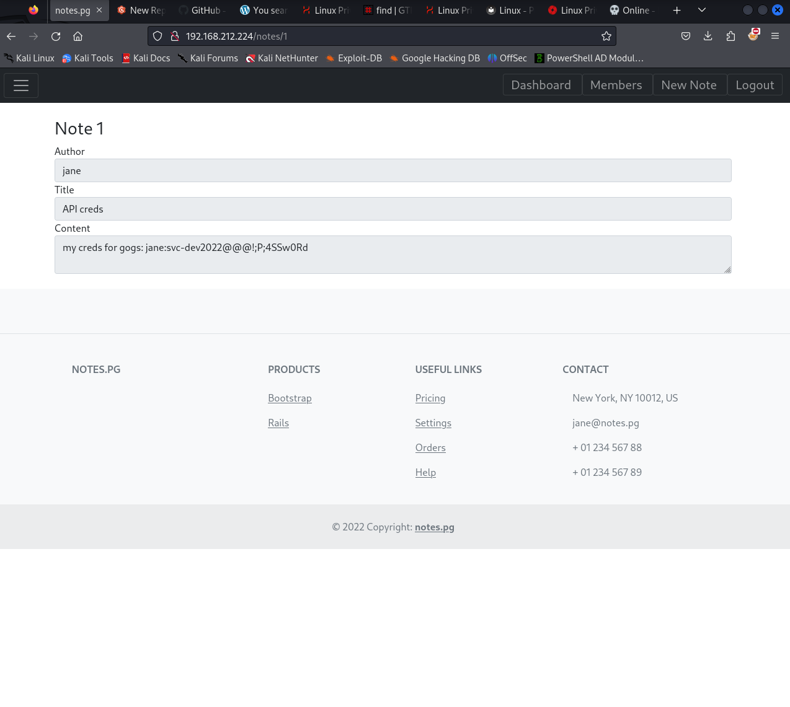

# Write-up  PG_assigment

* nmap to get port open


* on port 80 website is vuln ```IDOR``` to get cred ```gogs```




* gogs vuln RCE on create repos


* in user jane we find a script name /usr/bin/clean-tmp.sh this script make run  -exec with sudo
* and we must encrypt base64 and decyrpt to get shell

